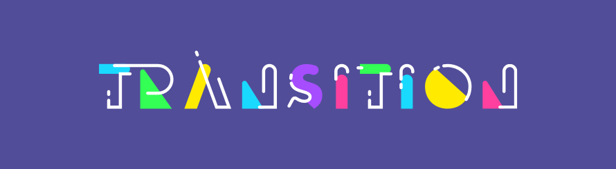
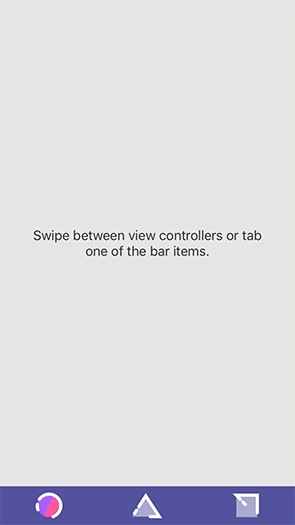
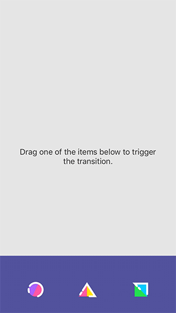
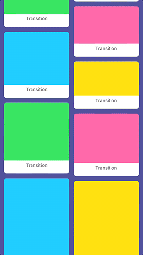

<div align="center">
    
</div>

[](https://cocoapods.org/pods/Transition) [](https://github.com/Carthage/Carthage) [](https://github.com/Touchwonders/Transition/blob/master/LICENSE) []()


## Introduction
**Transition** is a library that helps you build iOS view controller transitions. 
Implementing a nice interactive custom view controller transition involves quite a number of components. You have to implement the correct delegates, handle the switching between passive animation and active interaction phases, ensure the timing is right, think of interruption and cancellation, keep responsibilities separated... It quickly gets messy! This is where Transition helps you out: you just define the animation and the interaction, Transition ties it all together.

**In short:**

* You specify single-responsibility components (animation, interaction, ...)
* Transition ties them together

## Examples

There are several examples (which can be found in `Examples/`):

1. **SimpleExample**: implements the basic steps explained in this README.
2. **TabBarTransitionsExample**: shows you how to implement custom `UITabBarController` transition animations with custom interaction.
3. **ModalTransitionsExample**: shows you how to implement custom *modal* transition animations that include interaction with a **shared element**.
4. **BuiltInTransitionsCatalog**: shows a small collection of built-in transition animations.

To run an example project, clone the repo, navigate to one of these example directories, and run `pod install` from that directory first.

---



---

## Requirements

* iOS 10.0+
* Swift 3.0+

## Usage

### 1. The AnimationLayer

The `AnimationLayer` is the most essential part of setting up a transition; without it, there'll be no animation. An `AnimationLayer` is a simple struct that takes two arguments:

##### 1. Animation function
This is a simple closure with the signature `() -> Void`. In this closure you define your animation, just as you would with a `UIView` or `UIViewPropertyAnimator` animation. For each `AnimationLayer`, Transition will instantiate a `UIViewPropertyAnimator`, passing it your animation block.

##### 2. TimingParameters

This defines the timing of your animation. It must be a `UITimingCurveProvider`, such as an instance of `UICubicTimingParameters` or `UISpringTimingParameters`.

##### _(3. AnimationRange)_
Additionally, you can set an `AnimationRange`, which by default is set to `AnimationRange.full`. This range defines the start and end point (as fractions of the total transition animation duration) between which your `AnimationLayer`'s animation will run.

You create your `AnimationLayer` as follows:

```swift
let animationLayer = AnimationLayer(timingParameters: UICubicTimingParameters(animationCurve: .easeOut)
                                           animation: { topView?.transform = targetTransform })
```

**😦 ... Hey, wait! Where do that `topView` and `targetTransform` come from?**

### 2. The TransitionAnimation

Your `AnimationLayer` is defined as a part of your `TransitionAnimation`. This represents all (non-interactive) animation during a transition. The `TransitionAnimation` protocol exposes an array of `AnimationLayers`. Additionally it contains two functions; one for setup and one for completion. Before starting animation, your setup function will be called, passing you the transitioningContext that among others contains the `fromView` and `toView` in the transition. The completion function is called when the entire transition completes, allowing you to clean up any temporary views added in the setup.

```swift
class SimpleAnimation : TransitionAnimation {
    
    private weak var topView: UIView?
    private var targetTransform: CGAffineTransform = .identity
    
    func setup(in operationContext: TransitionOperationContext) {
        let context = operationContext.context
        let isPresenting = operationContext.operation.isPresenting
        
        //  We have to add the toView to the transitionContext, at the appropriate index:
        if isPresenting {
            context.containerView.addSubview(context.toView)
        } else {
            context.containerView.insertSubview(context.toView, at: 0)
        }
        context.toView.frame = context.finalFrame(for: context.toViewController)
        
        //  We only animate the view that will be on top:
        topView = isPresenting ? context.toView : context.fromView
        
        let hiddenTransform = CGAffineTransform(translationX: 0, y: -context.containerView.bounds.height)
        
        topView?.transform = isPresenting ? hiddenTransform : .identity
        targetTransform = isPresenting ? .identity : hiddenTransform
    }
    
    var layers: [AnimationLayer] {
        return [AnimationLayer(timingParameters: AnimationTimingParameters(animationCurve: .easeOut), animation: animate)]
    }
    
    func animate() {
        topView?.transform = targetTransform
    }
    
    func completion(position: UIViewAnimatingPosition) {}
}
```

**🤔 ... But what about duration?**

### 3. The Transition

You just defined the animation of your transition. You now create a **`Transition`** struct that has an `animation` part (your `TransitionAnimation`) and an optional `sharedElement` part, which you can see implemented in the Modal and Navigation examples. And the `Transition` has a duration!

```swift
let transition = Transition(duration: 2.0, animation: SimpleAnimation())
```

**😬 ... And where do I put that transition?**

### 4. The TransitionController

Almost there. Say you want to use this transition for `UINavigationController` transitions. Let's make a convenience object that isolates transition-related functionality for a navigationController:

```swift
class MyNavigationTransitions {
    let transitionController: TransitionController
    let transitionsSource = MyNavigationTransitionSource()
    
    init(navigationController: UINavigationController) {
        transitionController = TransitionController(forTransitionsIn: navigationController, transitionsSource: transitionsSource)
    }
}

class MyNavigationTransitionSource : TransitionsSource {
    func transitionFor(operationContext: TransitionOperationContext, interactionController: TransitionInteractionController?) -> Transition {
        return Transition(duration: 0.5, animation: SimpleAnimation())
    }
}
```

The `TransitionController` takes responsibility for animating transitions in the given navigationController, using an external `TransitionsSource` to provide operation-specific transitions (the operation – in this case push or pop – can be obtained from the `TransitionOperationContext`). This means you can return different transition animations for push and pop. You can also provide a single animation that behaves differently depending on the operation (see the `SimpleAnimation`).

Now, initialize your `MyNavigationTransitions`, passing it your navigationController.

**🤓 ... Is that it?**

Yes!

😎

At least, for custom view controller transition animations. There's a lot more that'll help you set up a custom interaction gesture and a shared element that can move between the transitioning views.

The above steps are implemented in the `SimpleExample` that can be found in the `Examples/` directory.

## Further reading

* [Adding custom interaction](Documentation/custom_interaction.md)
* [Adding a shared element](Documentation/shared_element.md)
* [A note on timing](Documentation/timing.md)

## Installation

Transition is available through [CocoaPods](http://cocoapods.org). To install
it, simply add the following line to your Podfile:

```ruby
pod 'Transition'
```

## Your input is welcome!
If you have any suggestions, please get in touch [with us](https://twitter.com/touchwonders). Feel free to fork and submit pull requests. Also, we're Dutch, so if any naming is odd, might be improved or is just plain inappropriate, let us know!

## Backlog
* Add functioning `UIPresentationController` support (it's there, but it doesn't animate properly...)
* Write more tests
* See if nonlinear scrubbing (iOS 11, https://developer.apple.com/videos/play/wwdc2017/230/) can be added
* ...?

## License

Transition is available under the MIT license. See the [LICENSE](LICENSE) file for more info.
